# Donaciones políticas en tiempos de guerra y paz

## Descripción y motivación
En octubre de 2012 el gobierno colombiano empezó negociaciones de paz con la guerrilla de las FARC. De este proceso resultaría un cese al fuego unilateral por parte del grupo armado en diciembre de 2014, y eventualmente la firma del acuerdo de paz y desmovilización en 2016.

Los efectos del proceso de paz con las FARC han sido heterogéneos. Por un lado, los municipios con presencia de la guerrilla experimentaron caídas relativas de gran magnitud en el número de eventos violentos después de cese al fuego, según datos del Centro de Recursos para el Análisis de Conflictos (CERAC). También mejoraron los outcomes educativos (Prem et al., 2021) y aumentó la tasa de fertilidad (Guerra-Cújar et al., 2021). No obstante, también se habrían generado incentivos perversos que aumentaron la deforestación (Prem, Saavedra, et al., 2020), los cultivos de coca (Prem, Vargas, et al., 2020), y el asesinato de líderes sociales (Marín Llanes, 2020).

¿Qué impacto generó el proceso de paz sobre la inversión privada? En principio, se esperaría un aumento en esta variable pues la reducción del conflicto y los beneficios del acuerdo de paz en las zonas afectadas por la guerra deberían mejorar la confianza empresarial. Un tipo específico de inversión son las donaciones a las campañas políticas. En este proyecto busco comprobar si las donaciones aumentaron en municipios con presencia de las FARC después del cese al fuego y del acuerdo de paz.

Presentación de este proyecto en PDF: [aquí](presentation/presentacion.pdf)

## Métodos usados
### Web Scraping
- El portal Cuentas Claras (https://www.cnecuentasclaras.gov.co/) contiene tres páginas (una por año) que permiten descargar información de financiación de las campañas para todos los candidatos a tres elecciones locales: 2011, 2015 y 2019.
  - 2011: https://app.cnecuentasclaras.gov.co/CuentasClarasTer2010/publicacioncandidatos.aspx 
  - 2015: https://app.cnecuentasclaras.gov.co/CuentasClarasPublicoTer2015/Consultas/Candidatos/
  - 2019: https://app.cnecuentasclaras.gov.co/CuentasClarasPublicoTer2019/Consultas/Candidatos/
- Los tres sitios web están renderizados en JavaScript y CSS. Utilicé la librería *RSelenium* en R para recorrer todos los municipios de Colombia, obtener la lista de candidatos a Alcaldía, y descargar el anexo 5.3B, que contiene todas las donaciones de privados. 
- Estos anexos están en formato excel, y contienen el nombre del donante y el monto donado. Los pasos para descargar la información varían de la siguiente manera:
  - Para 2015 y 2019, el código obtiene la lista de candidatos, incluido un identificador. Después usé un loop para ir a la página de cada candidato usando su ID y descargar la lista de donantes. Los siguientes enlaces llevan a los códigos para [2015](code/get_donors_15.R) y [2019](code/get_donors_19.R).
  - Para 2011 construí dos códigos. [Get_donors_11](code/get_donors_11.R) recorre todas las páginas municipales de candidatos a alcaldía, y descarga las bases de datos de donantes. [Unify_donors_11](code/unify_donors_11.R) une todas las hojas de excel y hace un emparejamiento con el candidato a través del nombre (pues para este año el portal no crea un identificador). 
### Enlace de candidatos y donantes en Pandas
- Utilicé Python para crear tres bases de datos (una por año) a nivel de muncipio, que contienen las siguientes variables de interés:
  - Número total de donantes por municipio.
  - Número de donantes promedio por candidato. 
  - Monto total donado por municipio.
  - Monto promedio de donaciones por candidato.
- Este proceso involucró los siguientes pasos:
  - Emparejar los candidatos con sus donantes para 2015 y 2019 usando el identificador del político.
  - Calcular el monto total para cada par candidato-donante, y el número total de donantes y monto por candidato. 
  - Computar las variables de interés por municipio
- El Jupyter Notebook que realiza esos pasos puede ser consultado [acá](code/merge_donors_datasets.ipynb)
### Generación de mapas y gráficos en R
- Con los datos de donación a nivel de municipio, construí las siguientes figuras en R:
  - Mapas que reflejan la distribución municipal de las variables de interés por año (Código [aquí](code/animated-map-donors.R)).
  - Top 10 municipios con los mayores valores en donación, según variable (Código [aquí](code/plot-rankofmpios.R)).
  - Evolución de las variables de interés en los tres años electorales, para los municipios con y sin presencia de las FARC en 2011 (Código [aquí](code/plot-evolutions-byfarc.R))
### Regresión lineal en R para estimar impacto del cese al fuego
- Usando la librería *Fixest*, estimé un modelo de diferencias en diferencias para identificar el impacto del cese al fuego sobre las estadísticas de donación. La ecuación a estimar es la siguiente:

 

Esta ecuación incluye efectos fijos de municipio (i), y de año de elección (t). (Ceasefile x FARC) es una dummy que toma el valor de 1 para municipios con presencia de las FARC después de 2014, y 0 si no se cummplen ambas condiciones. 

## Hallazgos
### Distribución espacial de las variables de interés (2011)
Las siguientes gráficas muestran cómo se distribuyen espacialmente las variables de interés para el año 2011. Las figuras para el resto de años se encuentran en el siguiente [enlace](output/evol-by-municipality/)

En términos generales, los donantes se encuentran concentrados en las grandes ciudades. Lo mismo sucede con el monto donado. 

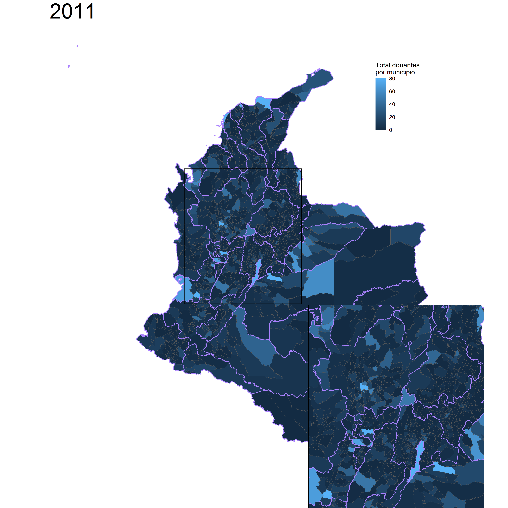 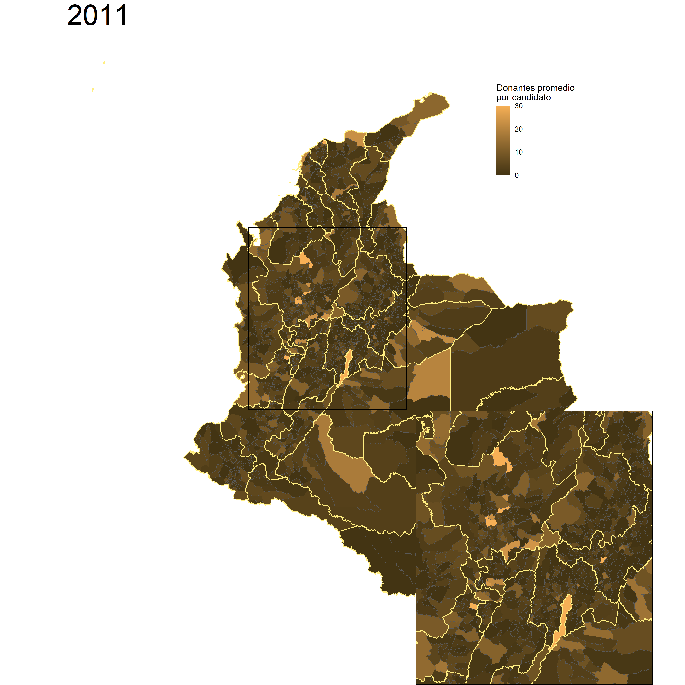
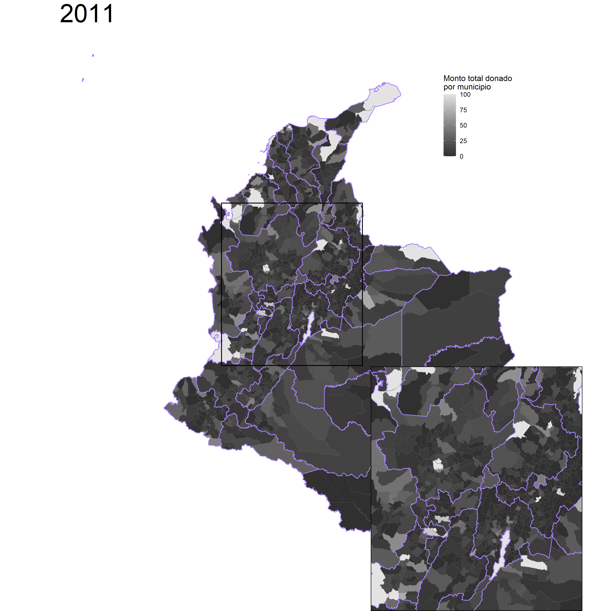 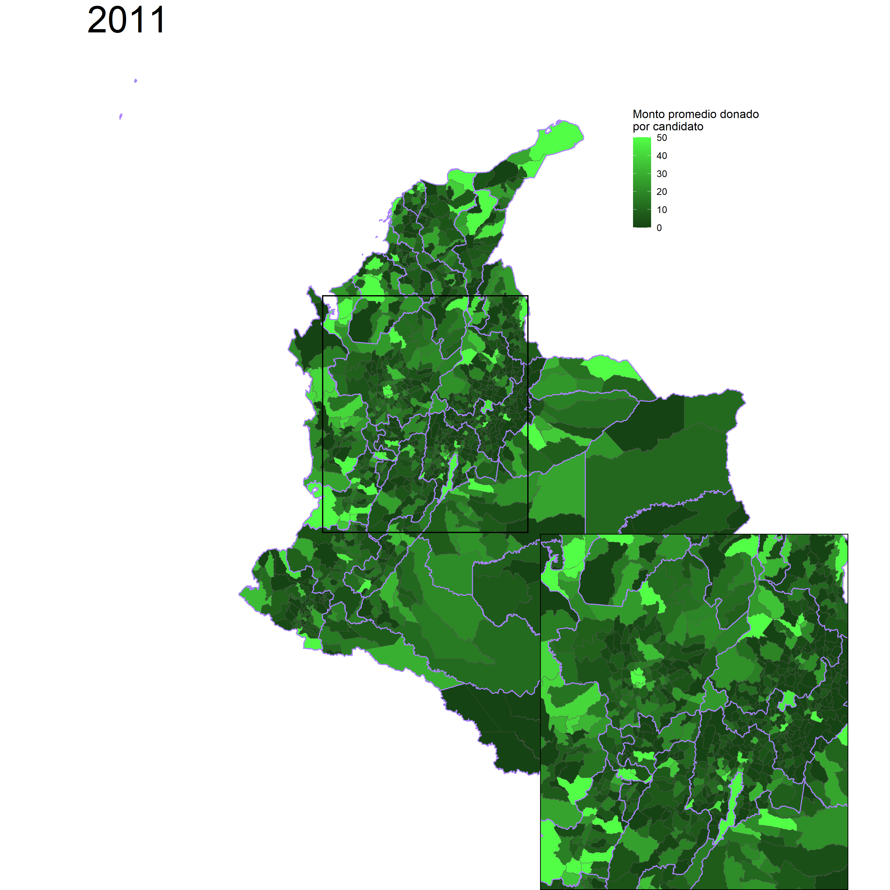

Las siguientes figuras enseñan el top 10 de municipios sin (en azul) y con (en rojo) presencia de las FARC en 2011 según promedio de estadísticas de donación. Si bien estos rankings están formados en gran medida por ciudades capitales, también sobresalen algunos municipios intermedios.

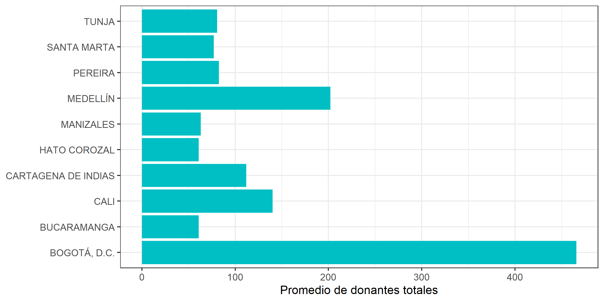 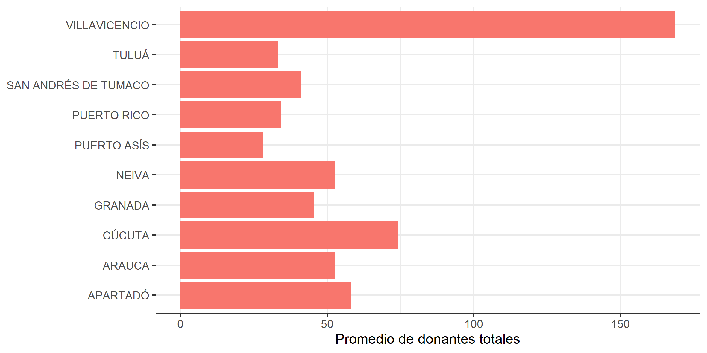
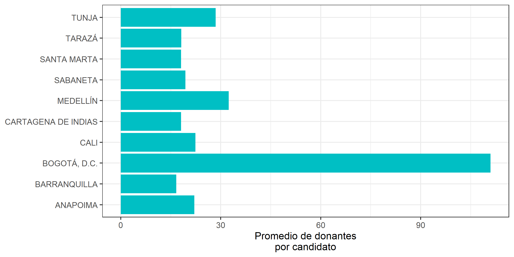 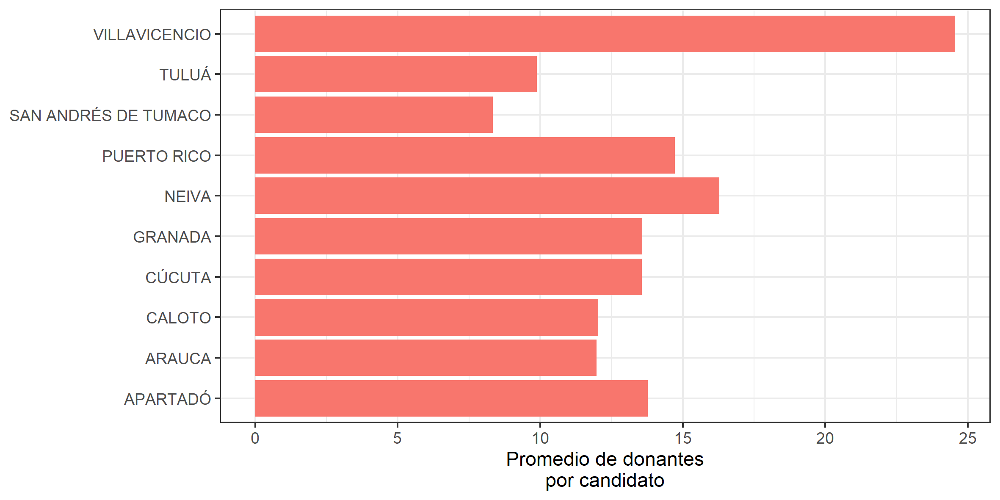
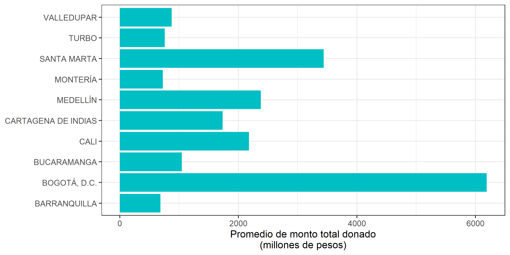 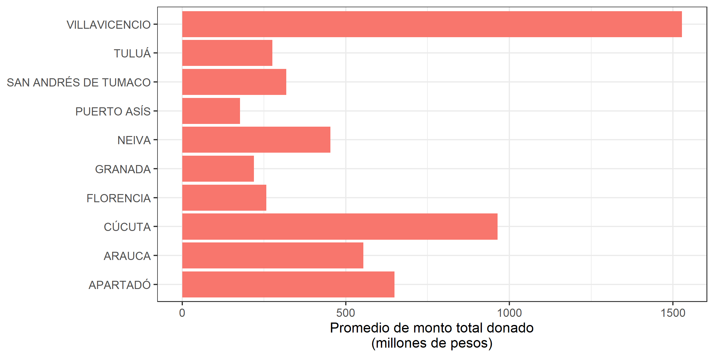

### Evaluación del impacto del cese al fuego sobre la donación privada

El modelo de diferencias en diferencias evalúa la evolución del *outcome* en el grupo de tratados (en este caso, municipios con presencia de las FARC) después del tratamiento, y la compara con la evolución en el grupo de control (en este caso, municipios sin presencia de las FARC). 

Para este estudio se esperaría que la donación creciera relativamente en los municipios con presencia de las FARC después del cese al fuego en 2014. Las siguientes figuras muestran la evolución del promedio de los cuatro outcomes de interés. Si bien se ve un crecimiento diferencial en el monto total donado por municipio, no es muy claro en las demás variables. Incluso, para 2019, vemos una disminución relativa en el monto de donación por candidato. 

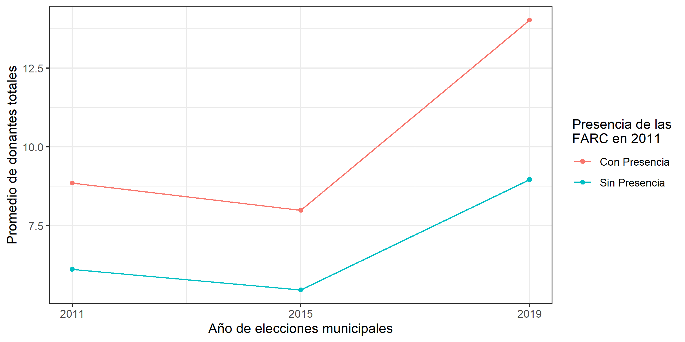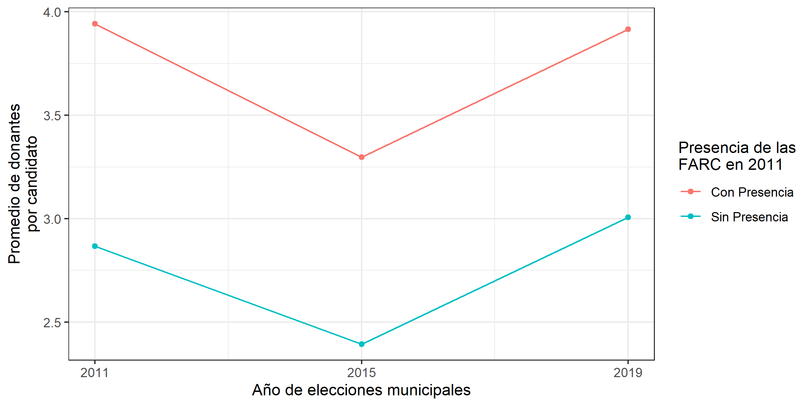
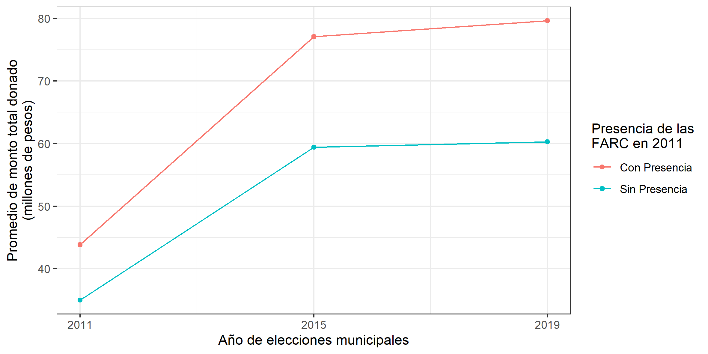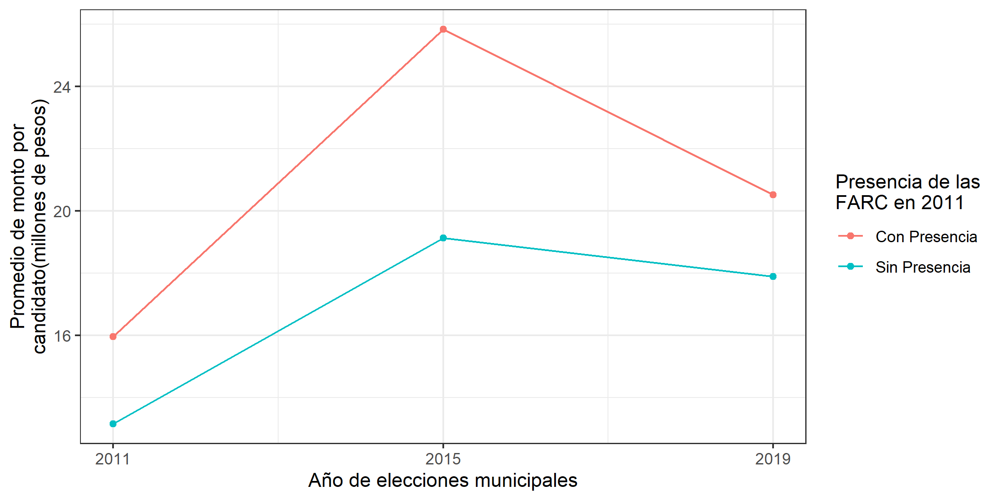

#### Estimación del modelo de diferencias en diferencias:
Debido a que las gráficas no muestran un efecto claro del proceso de paz sobre las donaciones, se procede a estimar la ecuación de efectos fijos. La siguiente tabla muestra los coeficientes y sus respectivos errores estándar en paréntesis. 

Si bien los coeficientes estimados tienen signo positivo (a excepción del de donantes por candidato), ninguno es estadísticamente diferente de cero bajo un nivel de significancia menor al 10%. Por tanto, por lo menos para las donaciones a candidatos a alcaldía, no se puede concluir que el cese al fuego y el acuerdo de paz generaron aumentos en la inversión política. 

|       &nbsp;        | Total de donantes | Donantes por cand. |log(Monto total) |log(Monto por cand)|
|:-------------------:|:-----------------:|:------------------:|:---------------:|:-----------------:|
|                     |                   |                    |                 |                   |
| **CEASEFIRExFARC**  |   1.057 (1.403)   |  -0.1621 (0.4312)  | 0.0429 (0.1418) | 0.0408 (0.1300)   |
| **Fixed-Effects:**  |   -------------   |  ----------------  | --------------- | ----------------- |
|  **Municipality**   |        Yes        |        Yes         |       Yes       |        Yes        |
|      **Year**       |        Yes        |        Yes         |        Yes      |        Yes        |
| **_______________** |   _____________   |  ________________  | _______________ | _________________ |
| **S.E.: Clustered** |   by: Municip..   |  by: Municipality  | by: Municipal.. |  by: Municipal..  |
|  **Observations**   |       3,365       |       3,365        |      2,421      |       2,421       |
|       **R2**        |       0.779       |       0.547        |      0.726      |       0.676       |

### Agenda a futuro:
- Incorporar nuevas corporaciones (concejos y juntas de acción comunal)
- Añadir más variables que demuestren la inversión privada en los municipios

## Referencias
Guerra-Cújar, M. E., Prem, M., Rodríguez-Lesmes, P., & Vargas, J. F. (2021). A Peace Baby Boom? Evidence from Colombia’s Peace Agreement. https://doi.org/10.31235/osf.io/c2ypd

Marín Llanes, L. (2020). Unintended Consequences of Alternative Development Programs: Evidence From Colombia’s Illegal Crop Substitution. Documento CEDE, No. 40. https://doi.org/10.2139/ssrn.3706297

Prem, M., Saavedra, S., & Vargas, J. F. (2020). End-of-conflict deforestation: Evidence from Colombia’s peace agreement. *World Development, 129*, 104852. https://doi.org/https://doi.org/10.1016/j.worlddev.2019.104852

Prem, M., Vargas, J. F., & Mejía, D. (2020). The Rise and Persistence of Illegal Crops: Evidence from a Naïve Policy Announcement.

Prem, M., Vargas, J. F., & Namen, O. (2021). The Human Capital Peace Dividend. *Journal of Human Resources*. https://doi.org/10.3368/jhr.59.1.0320-10805R2 

